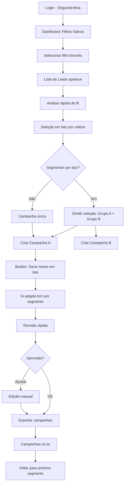
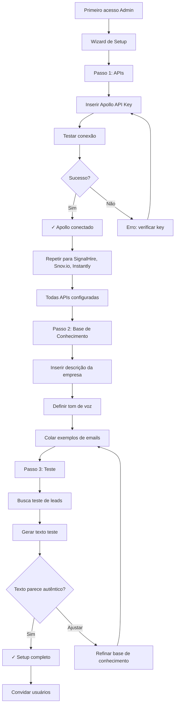

# UX Design Specification - tdec-prospect

**Author:** Fabossi
**Date:** 2026-01-29

---

## Executive Summary

### Project Vision

O tdec-prospect é uma plataforma de otimização de prospecção outbound que unifica captação de leads e construção de campanhas em uma experiência visual elegante. O diferencial está na combinação de busca conversacional com IA ("Me busca 50 leads de empresas de tecnologia em SP") e geração de textos profundamente personalizados que soam autênticos - não genéricos.

A plataforma funciona como camada de inteligência sobre ferramentas existentes (Apollo, SignalHire, Instantly), focando no que faz melhor: personalização e experiência visual premium.

### Target Users

**Marco - Diretor Comercial (Primário)**
- Hands-on, gosta de estar na linha de frente
- Quer velocidade + qualidade sem depender 100% da equipe
- Momento de sucesso: criar campanha completa em <15 minutos

**Carla - SDR Operacional (Secundário)**
- Meta-driven, processa alto volume
- Precisa de produtividade sem sacrificar qualidade
- Momento de sucesso: 50 leads qualificados por semana com textos personalizados

**Admin (Setup)**
- Configura integrações e base de conhecimento
- Momento de sucesso: sistema pronto para uso em uma sessão

### Key Design Challenges

1. **Tradução Conversacional** - Converter linguagem natural em filtros de busca precisos sem frustrar o usuário quando a IA não entende perfeitamente
2. **Confiança na IA** - Criar interface que transmita qualidade do texto gerado para o usuário aprovar sem precisar revisar palavra por palavra
3. **Unificação de Fluxo** - Consolidar múltiplas ações (busca → seleção → campanha → export) em jornada fluida e intuitiva
4. **Simplicidade Percebida** - Esconder complexidade técnica (4+ integrações) atrás de interface limpa e direta

### Design Opportunities

1. **Visual Premium como Diferencial** - Interface no padrão Attio/Airtable diferencia imediatamente de ferramentas enterprise "feias"
2. **Feedback de IA em Tempo Real** - Animações e estados de loading que mostram a IA "pensando" aumentam confiança e engajamento
3. **Momento "Aha!" Destacado** - Design que amplifica o momento em que o usuário lê o texto e pensa "parece que fui eu que escrevi"
4. **Escalonamento One-Click** - Lead interessado → buscar telefone → ligar em fluxo natural e imediato

## Core User Experience

### Defining Experience

O tdec-prospect tem um loop de valor claro: **Buscar leads → Criar campanha personalizada → Exportar para execução**. A ação mais frequente é a busca de leads (uso diário), mas a ação mais crítica é a geração de texto com IA - é onde o "momento aha!" acontece ou não.

O produto vive ou morre na qualidade do texto gerado. Se parecer robótico ou genérico, o usuário volta para fazer manualmente. Se parecer autêntico, o usuário confia e adota.

**Builder Visual como Experiência Central:** O construtor drag-and-drop no estilo Attio é fundamental para a experiência. Não é apenas funcional - é o que torna a construção de campanhas algo prazeroso e intuitivo. A sensação de "montar" visualmente a sequência de emails traz:
- Minimalismo com modernidade
- Sensação de controle e ownership
- Feedback visual imediato das decisões
- Diferenciação clara de interfaces enterprise tradicionais

### Platform Strategy

| Aspecto | Decisão |
|---------|---------|
| **Plataforma** | Web Application (SPA) |
| **Dispositivo primário** | Desktop com mouse/keyboard |
| **Responsivo** | Tablet suportado, mobile baixa prioridade |
| **Offline** | Não requerido (dependência de APIs externas) |
| **Browser** | Chrome, Firefox, Safari, Edge modernos |

**Justificativa:** Prospecção outbound é trabalho de escritório. Usuários estão em desktops com múltiplas abas abertas. Interface deve ser otimizada para produtividade com teclado.

### Effortless Interactions

| Interação | Expectativa de Esforço |
|-----------|----------------------|
| **Busca conversacional** | Digitar frase natural → resultados em <3s |
| **Geração de texto IA** | 1 clique → texto pronto para uso |
| **Builder drag-and-drop** | Arrastar blocos → sequência construída visualmente |
| **Seleção de leads** | Checkbox + "Selecionar todos" em 2 cliques |
| **Export de campanha** | 1 clique → confirmação de sucesso |
| **Escalonamento (telefone)** | Lead interessado → buscar telefone em 1 clique |

**Princípio:** Se o usuário precisa pensar "como faço isso?", falhamos.

### Critical Success Moments

1. **Primeiro texto gerado pela IA** - Usuário lê e pensa "isso é bom" ou "parece que fui eu que escrevi". Este momento define se o produto será adotado.

2. **Primeira campanha construída no builder** - A experiência de arrastar blocos e ver a sequência tomando forma visualmente. Sensação de "isso é elegante".

3. **Primeira campanha completa exportada** - Busca → Seleção → Textos → Export funcionando de ponta a ponta. Prova que o sistema funciona.

4. **Primeiro lead que responde** - Validação real de que a personalização contextualizada converte melhor que texto genérico.

5. **Comparação de tempo** - Quando o usuário percebe que fez em 15 minutos o que antes levava 2 horas.

### Experience Principles

1. **Velocidade Perceptível** - Cada ação tem feedback imediato. Estados de loading são elegantes e informativos, não frustrantes. O sistema nunca "trava" sem explicação.

2. **Confiança na IA** - Textos gerados têm qualidade consistente. Usuário pode aprovar sem revisar cada palavra. Menos regenerações = mais confiança.

3. **Construção Visual** - O builder drag-and-drop é central na experiência. Arrastar, soltar, reorganizar - cada interação deve ser fluida e responsiva. O usuário "constrói" sua campanha, não "preenche formulários".

4. **Fluxo Contínuo** - A jornada Busca → Seleção → Campanha → Export flui naturalmente. Não há becos sem saída ou necessidade de "voltar e recomeçar".

5. **Simplicidade Visual** - Interface premium no estilo Attio/Airtable. Complexidade técnica (4+ integrações) é invisível para o usuário. Menos elementos = mais foco.

## Desired Emotional Response

### Primary Emotional Goals

**Emoção Central: Empoderamento através da Eficiência**

O usuário deve se sentir capaz e produtivo - fazendo em minutos o que antes levava horas. Não é apenas "mais rápido", é "surpreendentemente mais rápido sem perder qualidade".

**Impacto Visual Imediato:** Antes mesmo de interagir, o usuário deve ser impressionado pelo layout - clean, moderno, prático. Essa primeira impressão visual estabelece a expectativa de qualidade para tudo que vem depois. É a diferença entre abrir uma ferramenta enterprise "feia" e abrir algo que parece produto de design europeu.

**Hierarquia Emocional:**

1. **Impressionado** - "Isso é bonito" - impacto visual imediato que gera confiança
2. **Eficiente** - "Estou fazendo mais em menos tempo" - sensação de produtividade multiplicada
3. **Confiante** - "A IA sabe o que está fazendo" - posso aprovar sem revisar cada palavra
4. **No controle** - "Eu construo, eu decido" - a ferramenta me serve, não o contrário
5. **Surpreendido (positivamente)** - "Isso ficou melhor do que esperava" - momentos de "wow"

### Emotional Journey Mapping

| Momento na Jornada | Emoção Desejada | Gatilho de Design |
|-------------------|-----------------|-------------------|
| **Primeiro acesso** | Impressionado + Curiosidade | Layout clean, visual premium, "isso é diferente" |
| **Primeira busca conversacional** | Impressionado | Resultados rápidos e relevantes |
| **Primeiro texto gerado** | Surpresa positiva | Qualidade que supera expectativa |
| **Construindo no builder** | Satisfação + Flow | Drag-and-drop responsivo, visual elegante |
| **Exportando campanha** | Realização | Confirmação clara de sucesso |
| **Quando algo dá errado** | Calma + Direção | Erro explicado + próximo passo |
| **Uso recorrente** | Familiaridade + Domínio | Consistência, atalhos descobertos |

### Micro-Emotions

**Cultivar ativamente:**
- **Admiração visual** → Layout que impressiona, detalhes que mostram cuidado
- **Confiança** → Qualidade consistente, transparência sobre o que a IA está fazendo
- **Controle** → Tudo editável, nada irreversível, confirmações claras
- **Fluidez** → Transições suaves, zero loading inesperado
- **Clareza** → Hierarquia visual óbvia, zero ambiguidade
- **Orgulho** → Textos que parecem escritos pelo usuário, campanha bonita de mostrar

**Evitar ativamente:**
- **Desconfiança** → Nunca deixar o usuário pensando "será que isso está certo?"
- **Impotência** → Sempre oferecer forma de editar, ajustar, refazer
- **Frustração** → Zero loading longo sem feedback, zero erros sem explicação
- **Confusão** → Nunca "onde está aquilo?" ou "como faço isso?"
- **Vergonha** → Nunca "esse texto é genérico demais para enviar"

### Design Implications

| Emoção Alvo | Decisão de Design |
|-------------|-------------------|
| **Admiração visual** | Espaçamento generoso, tipografia premium, cores sofisticadas, atenção aos detalhes |
| **Eficiência** | Fluxos em poucos cliques, feedback instantâneo, batch actions |
| **Confiança na IA** | Mostrar "IA pensando" com elegância, preview antes de confirmar, fácil regenerar |
| **Controle** | Drag-and-drop, edição inline em qualquer texto, undo disponível |
| **Surpresa positiva** | Textos que superem expectativas, micro-animações sutis |
| **Calma em erros** | Mensagens em português claro, nunca culpar usuário, sempre próximo passo |

### Emotional Design Principles

1. **Visual que Impressiona** - O layout deve causar impacto positivo imediato. Clean, moderno, prático. Cada pixel conta. É a primeira promessa de qualidade que fazemos ao usuário.

2. **Transparência da IA** - Mostrar quando a IA está trabalhando e o que ela está fazendo. "Gerando texto personalizado para João da TechCorp..." é melhor que spinner genérico.

3. **Controle Sempre Disponível** - Nada é final até o usuário dizer que é. Editar, regenerar, voltar - sempre possível. Sensação de "eu decido".

4. **Celebrar Micro-Sucessos** - Feedback positivo sutil quando ações completam. Não exagerar, mas reconhecer progresso.

5. **Falhar com Graça** - Erros acontecem. Quando acontecerem: explicar claramente, não culpar, oferecer solução. Tom calmo, não alarmista.

6. **Consistência Gera Confiança** - Padrões visuais e de interação consistentes. Usuário aprende uma vez, aplica em todo lugar.

## UX Pattern Analysis & Inspiration

### Inspiring Products Analysis

#### Attio - Visual Premium
- Design minimalista e sofisticado com espaçamento generoso
- Tipografia limpa e cores neutras com acentos sutis
- Transições suaves que comunicam qualidade
- **Lição:** Visual premium diferencia de ferramentas enterprise "feias"

#### Airtable - Tabelas Flexíveis
- Tabelas que não parecem Excel - bonitas e organizadas
- Drag-and-drop intuitivo para reorganização
- Sistema de cores para categorização visual
- Views múltiplas (tabela, kanban, calendar)
- **Lição:** Listas de leads podem ser visualmente elegantes

#### Linear - Performance Percebida
- Carregamento instantâneo em todas as ações
- Atalhos de teclado para power users
- Zero spinners longos - feedback imediato
- Minimalismo que elimina distrações
- **Lição:** Velocidade percebida é tão importante quanto velocidade real

#### Notion - Blocos Modulares
- Conceito de "blocos" que se conectam e reorganizam
- Comandos com "/" para ações rápidas
- Flexibilidade sem complexidade aparente
- Templates como aceleradores
- **Lição:** Builder de campanhas pode usar metáfora de blocos

### Transferable UX Patterns

| Categoria | Padrão | Aplicação no tdec-prospect |
|-----------|--------|---------------------------|
| **Visual** | Espaçamento generoso (Attio) | Toda a interface - respiração visual |
| **Tabelas** | Estilo Airtable | Lista de leads elegante e funcional |
| **Builder** | Blocos arrastáveis (Notion) | Construtor de sequências de email |
| **Performance** | Instantâneo (Linear) | Busca e geração sem loading perceptível |
| **Comandos** | "/" para ações (Notion) | Busca conversacional iniciada com "/" |
| **Cores** | Neutras + acentos (Attio) | Paleta sofisticada e profissional |
| **Feedback** | Micro-animações (Linear) | Confirmações sutis de ações |

### Anti-Patterns to Avoid

| Anti-Padrão | Por que evitar | Alternativa |
|-------------|----------------|-------------|
| **Interface apertada** | Parece software legado, cansa visualmente | Espaçamento generoso estilo Attio |
| **Excesso de botões** | Overwhelms, paralisa decisão | Ações contextuais, progressivas |
| **Loading genérico** | Gera ansiedade sem informação | "Gerando texto para João..." |
| **Wizards forçados** | "Passo 1 de 7" parece burocrático | Fluxo livre com orientação sutil |
| **Cores enterprise** | Azul/cinza sem personalidade | Paleta própria com identidade |
| **Modais excessivos** | Interrompe fluxo mental | Inline editing, sidepanels |
| **Confirmações demais** | Fricção desnecessária | Undo disponível em vez de "Tem certeza?" |

### Design Inspiration Strategy

**Adotar diretamente:**
- Espaçamento generoso estilo Attio - é o padrão de qualidade visual
- Tabelas estilo Airtable - leads organizados visualmente
- Performance Linear - nada pode parecer lento

**Adaptar para nosso contexto:**
- Blocos Notion → Blocos de email no builder de sequências
- Comandos "/" → Iniciar busca conversacional
- Views Airtable → Diferentes formas de ver leads (tabela, cards)

**Evitar conscientemente:**
- Qualquer coisa que pareça "software enterprise"
- Modais interruptivos - preferir sidepanels e inline
- Loading sem contexto - sempre explicar o que está acontecendo

**Princípio guia:** Se parece Apollo ou Salesforce, simplificar. Se parece Attio ou Linear, estamos no caminho certo.

## Design System Foundation

### Design System Choice

**Escolha: shadcn/ui + Tailwind CSS**

shadcn/ui é uma coleção de componentes copiáveis (não uma biblioteca) construída sobre Radix UI e Tailwind CSS. Diferente de bibliotecas tradicionais, você copia o código dos componentes para seu projeto e tem ownership total.

### Rationale for Selection

| Critério | Por que shadcn/ui + Tailwind |
|----------|------------------------------|
| **Visual Premium** | Base minimalista que pode ser refinada para estética Attio |
| **Velocidade MVP** | Componentes prontos aceleram desenvolvimento inicial |
| **Customização** | Código é seu - modifique livremente sem limitações |
| **Não reconhecível** | Diferente de Material/Chakra, não "parece template" |
| **Stack alignment** | Perfeito para React/Next.js (sugerido no PRD) |
| **Flexibilidade** | Base sólida para componentes únicos como o builder |
| **Performance** | Só inclui código que usa - bundle otimizado |
| **Acessibilidade** | Radix UI por baixo garante a11y nativa |

### Implementation Approach

**Fase 1 - Setup Base (MVP):**
- Instalar Tailwind CSS com configuração customizada
- Copiar componentes shadcn necessários (Button, Input, Table, Card, Dialog, etc.)
- Definir paleta de cores inspirada em Attio (neutras + acentos)
- Configurar tipografia Inter ou similar

**Fase 2 - Componentes de Produto:**
- Builder de sequências (drag-and-drop customizado)
- Cards de leads estilo Airtable
- Chat/input de IA conversacional
- Preview de emails
- Tabela de leads com seleção em lote

**Fase 3 - Refinamento Visual:**
- Micro-animações e transições
- Estados de loading contextuais
- Feedback visual de ações
- Polish de detalhes

### Customization Strategy

**Design Tokens a Definir:**

| Token | Descrição |
|-------|-----------|
| `--background` | Neutro claro (fundo principal) |
| `--foreground` | Texto escuro (contraste) |
| `--primary` | Acento principal (ações) |
| `--secondary` | Acento secundário |
| `--muted` | Elementos desabilitados |
| `--accent` | Destaque especial |
| `--destructive` | Ações destrutivas |

**Espaçamento:** Base de 4px, múltiplos de 8, 12, 16, 24, 32, 48, 64

**Tipografia:** Inter (sans-serif), JetBrains Mono (código/dados)

**Bordas:** 6px radius (cantos levemente arredondados)

**Sombras:** Sutis para elevação (sm, md para cards/modais)

**Componentes Customizados Necessários:**

| Componente | Baseado em | Customização |
|------------|------------|--------------|
| EmailBlock | Card | Drag handle, preview, edição inline |
| LeadRow | Table Row | Checkbox, status badge, actions |
| AIInput | Input + Command | Sugestões, "/", loading state |
| SequenceBuilder | - | Canvas drag-and-drop completo |
| ExportButton | Button | Loading com progresso, confirmação |

**Princípio:** Começar com shadcn vanilla, customizar progressivamente baseado em feedback real.

## Defining User Experience

### Defining Experience Statement

**"Monte sua campanha arrastando blocos, a IA escreve textos que parecem seus."**

O tdec-prospect tem uma experiência definidora composta por dois elementos inseparáveis:

1. **Builder Visual Drag-and-Drop** - A estrutura da campanha é construída visualmente, arrastando blocos de email para um canvas. Isso traz sensação de controle, elegância e diferenciação.

2. **Geração de Texto Contextualizada** - Cada bloco é preenchido por IA que conhece o negócio do usuário e gera textos que soam autênticos, não genéricos.

A combinação é o diferencial: o visual premium do builder com a qualidade surpreendente dos textos.

### User Mental Model

**Modelo mental atual (fragmentado):**
1. Apollo para buscar leads (filtros manuais)
2. Planilha para organizar
3. ChatGPT para gerar textos (genéricos)
4. Copy/paste para ferramenta de envio
5. Personalização manual (quando há tempo)

**Frustrações com modelo atual:**
- Alternar entre 5+ ferramentas constantemente
- Textos genéricos que não convertem
- Processo lento e repetitivo
- Sem visão unificada do fluxo

**Expectativa para tdec-prospect:**
- "Digo o que quero, aparece pronto"
- "IA que conhece meu negócio de verdade"
- "Interface bonita, não software enterprise"
- "Tudo em um lugar só"

### Success Criteria

| Critério | Métrica | Meta |
|----------|---------|------|
| **Velocidade** | Tempo para campanha completa | <15 minutos |
| **Qualidade IA** | Textos aprovados sem edição | >70% |
| **Reação ao texto** | Feedback qualitativo | "Parece que fui eu que escrevi" |
| **Centralização** | % de trabalho feito no tdec-prospect | Tendência a 100% |
| **Recorrência** | Frequência de uso semanal | 4-5 dias/semana |
| **Satisfação builder** | Feedback qualitativo | "Isso é elegante" |

### Novel UX Patterns

| Elemento | Classificação | Estratégia de Design |
|----------|--------------|---------------------|
| **Busca conversacional** | Semi-novel | Combina chat + busca - input de texto livre com sugestões |
| **Builder drag-and-drop** | Estabelecido | Seguir padrões Notion/Airtable que usuários conhecem |
| **Geração de texto IA** | Estabelecido | ChatGPT educou mercado, adicionar contexto de negócio |
| **Tabela de leads** | Estabelecido | Estilo Airtable - familiar e elegante |
| **Export one-click** | Estabelecido | Padrão de integração simples |

**Conclusão:** O produto usa principalmente padrões estabelecidos combinados de forma inovadora. A novidade está na integração, não nos padrões individuais. Isso reduz curva de aprendizado.

### Experience Mechanics

#### Fluxo Principal: Criar Campanha

**Fase 1 - Iniciação:**
- Usuário seleciona leads na tabela (checkboxes)
- Botão "Criar Campanha" aparece na barra de ações
- Clique abre o builder com leads já associados

**Fase 2 - Construção no Builder:**
- Canvas central vazio com hint visual "Arraste blocos aqui"
- Sidebar esquerda com blocos disponíveis:
  - 📧 Email (principal)
  - ⏱️ Delay (intervalo entre emails)
  - 🔀 Condição (futuro)
- Drag do bloco para canvas → bloco aparece com animação suave
- Blocos se conectam automaticamente em sequência vertical
- Reorganização por drag dentro do canvas

**Fase 3 - Geração de Texto:**
- Clique no bloco de email abre sidepanel
- Campos: Assunto, Corpo, CTA
- Botão "✨ Gerar com IA" proeminente
- Ao clicar:
  - Botão muda para estado de loading
  - Texto aparece progressivamente (streaming)
  - Indicador: "Gerando texto personalizado para [nome do lead]..."
- Texto pronto: preview renderizado, opção de editar inline

**Fase 4 - Feedback Contínuo:**
- Bloco sem texto: borda neutra
- Bloco gerando: borda animada (pulse sutil)
- Bloco com texto: borda verde sutil + badge "✓"
- Barra de progresso no topo: "3 de 4 emails prontos"

**Fase 5 - Completação e Export:**
- Todos os blocos preenchidos → botão "Exportar" fica ativo
- Clique abre modal de destino:
  - Instantly (integrado)
  - Snov.io (integrado)
  - Copiar (manual)
- Seleção de destino → confirmação de envio
- Sucesso: "✓ Campanha exportada para Instantly"
- Opções pós-export: "Ver no Instantly" | "Criar nova campanha"

## Visual Design Foundation

### Color System

**Tema: Dark Mode Premium baseado em #070C1B**

Paleta dark mode sofisticada inspirada em Linear/Vercel - moderna, elegante e profissional.

#### Base Colors

| Token | Valor | Uso |
|-------|-------|-----|
| `--background` | `#070C1B` | Fundo principal da aplicação |
| `--background-secondary` | `#0D1425` | Cards, superfícies elevadas |
| `--background-tertiary` | `#141D2F` | Hover states, sidepanels |
| `--foreground` | `#F8FAFC` | Texto principal |
| `--foreground-muted` | `#94A3B8` | Texto secundário |
| `--border` | `#1E293B` | Bordas sutis |
| `--border-hover` | `#334155` | Bordas em hover |
| `--input` | `#1E293B` | Bordas de inputs |
| `--ring` | `#6366F1` | Focus ring |

#### Semantic Colors

| Token | Valor | Uso |
|-------|-------|-----|
| `--primary` | `#6366F1` | Ações principais, CTAs (índigo) |
| `--primary-hover` | `#818CF8` | Primary em hover |
| `--primary-foreground` | `#FFFFFF` | Texto sobre primary |
| `--secondary` | `#1E293B` | Backgrounds secundários |
| `--secondary-foreground` | `#F8FAFC` | Texto sobre secondary |
| `--muted` | `#1E293B` | Backgrounds muted |
| `--muted-foreground` | `#94A3B8` | Texto secundário/placeholder |
| `--accent` | `#8B5CF6` | Destaques especiais, IA (violeta) |
| `--accent-foreground` | `#FFFFFF` | Texto sobre accent |

#### Status Colors

| Token | Valor | Uso |
|-------|-------|-----|
| `--success` | `#22C55E` | Confirmações, ações bem-sucedidas |
| `--success-muted` | `#166534` | Background de badges success |
| `--warning` | `#F59E0B` | Alertas, atenção necessária |
| `--warning-muted` | `#92400E` | Background de badges warning |
| `--destructive` | `#EF4444` | Erros, ações destrutivas |
| `--destructive-muted` | `#991B1B` | Background de badges error |

#### Gradients & Effects

| Efeito | Valor | Uso |
|--------|-------|-----|
| `--glow-primary` | `0 0 20px rgba(99, 102, 241, 0.3)` | Glow em botões primários |
| `--glow-accent` | `0 0 20px rgba(139, 92, 246, 0.3)` | Glow em elementos de IA |
| `--glass` | `rgba(13, 20, 37, 0.8) + backdrop-blur` | Efeito glassmorphism |

### Typography System

**Família principal:** Inter
**Família monospace:** JetBrains Mono

#### Type Scale

| Nível | Tamanho | Peso | Line Height | Uso |
|-------|---------|------|-------------|-----|
| **Display** | 32px | 600 | 1.2 | Títulos de página |
| **H1** | 24px | 600 | 1.3 | Títulos de seção |
| **H2** | 20px | 600 | 1.4 | Subtítulos |
| **H3** | 16px | 500 | 1.4 | Títulos de cards |
| **Body** | 14px | 400 | 1.5 | Texto principal |
| **Body Small** | 13px | 400 | 1.5 | Texto secundário |
| **Caption** | 12px | 400 | 1.4 | Labels, captions |
| **Mono** | 13px | 400 | 1.5 | Código, dados |

#### Typography Principles

1. **Alto contraste** - Texto claro sobre fundo escuro com ratio mínimo 7:1
2. **Hierarquia clara** - Diferença visual óbvia entre níveis
3. **Legibilidade** - Line heights generosos para conforto em dark mode
4. **Consistência** - Mesmo scale em toda aplicação

### Iconography System

**Biblioteca: Lucide React**

Utilizamos exclusivamente [Lucide React](https://lucide.dev/) para ícones em toda a aplicação. Lucide é um fork do Feather Icons com mais de 1400 ícones consistentes.

**Por que Lucide React:**

| Critério | Benefício |
|----------|-----------|
| **Consistência** | Todos os ícones seguem o mesmo estilo de linha (stroke-based) |
| **Sem cor** | Ícones monocromáticos que herdam `currentColor` do texto |
| **Leve** | Tree-shakeable - só inclui ícones usados no bundle |
| **Acessível** | SVG com atributos ARIA configuráveis |
| **Customizável** | Tamanho e stroke-width via props |

**Especificações de Uso:**

| Aspecto | Valor | Exemplo |
|---------|-------|---------|
| **Tamanho padrão** | 20x20px (`h-5 w-5`) | Navegação, botões |
| **Tamanho pequeno** | 16x16px (`h-4 w-4`) | Badges, inputs |
| **Tamanho grande** | 24x24px (`h-6 w-6`) | Headers, destaque |
| **Stroke width** | 2px (padrão Lucide) | - |
| **Cor** | `currentColor` | Herda do texto pai |

**Implementação:**

```tsx
import { Settings, ChevronRight, Loader2 } from "lucide-react";

// Uso padrão
<Settings className="h-5 w-5" />

// Com cor customizada
<Settings className="h-5 w-5 text-muted-foreground" />

// Loading spinner
<Loader2 className="h-5 w-5 animate-spin" />
```

**Ícones por Contexto:**

| Contexto | Ícones Usados |
|----------|---------------|
| **Navegação** | `Users`, `Send`, `Settings`, `ChevronLeft`, `ChevronRight` |
| **Ações** | `LogOut`, `Eye`, `EyeOff` |
| **Status** | `Loader2` (loading), `Check`, `X` |
| **Tema** | `Moon`, `Sun` |

**Princípios:**

1. **Monocromático** - Nunca usar ícones coloridos; cor vem do contexto
2. **Significativo** - Ícone deve ser autoexplicativo ou acompanhado de label
3. **Consistente** - Mesmo ícone = mesma ação em toda aplicação
4. **Acessível** - Usar `aria-label` quando ícone está sozinho

### Spacing & Layout Foundation

#### Spacing Scale

Base unit: 4px

| Token | Valor | Uso comum |
|-------|-------|-----------|
| `--space-1` | 4px | Gaps mínimos |
| `--space-2` | 8px | Padding interno de botões |
| `--space-3` | 12px | Gap entre elementos relacionados |
| `--space-4` | 16px | Padding de cards |
| `--space-6` | 24px | Gap entre seções |
| `--space-8` | 32px | Margin entre blocos |
| `--space-12` | 48px | Padding de áreas grandes |
| `--space-16` | 64px | Padding de página |

#### Layout Grid

| Aspecto | Valor |
|---------|-------|
| **Colunas** | 12 |
| **Gutter** | 24px |
| **Max width** | 1440px |
| **Margin** | Auto (centrado) |

#### Component Dimensions

| Elemento | Valor |
|----------|-------|
| **Sidebar** | 240px (colapsada: 64px) |
| **Header** | 64px altura |
| **Border radius** | 6px (default), 8px (cards), 12px (modais) |
| **Input height** | 40px |
| **Button height** | 36px (sm), 40px (default), 44px (lg) |

#### Layout Principles

1. **Espaçamento generoso** - Dark themes precisam de mais breathing room
2. **Elevação por cor** - Usar tons mais claros para indicar elevação (não sombras)
3. **Bordas sutis** - Separação de elementos com bordas de baixo contraste
4. **Foco em conteúdo** - Fundo escuro faz conteúdo "pop"

### Accessibility Considerations

| Requisito | Implementação |
|-----------|---------------|
| **Contraste de texto** | Mínimo WCAG AAA (7:1) para texto principal em dark mode |
| **Focus visible** | Ring de 2px com cor primary (#6366F1) em todos interativos |
| **Touch targets** | Mínimo 44x44px para mobile/tablet |
| **Color independence** | Ícones/texto além de cor para status |
| **Motion** | Respeitar `prefers-reduced-motion` |
| **Dark mode native** | Sem toggle - dark mode é o padrão |

**Notas específicas para dark theme:**
- Evitar preto puro (#000) - usar navy (#070C1B) para reduzir contraste extremo
- Texto principal em off-white (#F8FAFC) não branco puro
- Cores de status levemente dessaturadas para não "agredir" em fundo escuro

## Design Direction Decision

### Design Directions Explored

Seis direções de design foram exploradas através do HTML visualizer interativo:

| Direção | Conceito | Características |
|---------|----------|-----------------|
| **1. Sidebar Layout** | Navegação lateral clássica | Sidebar persistente, conteúdo principal à direita, header compacto |
| **2. Builder Focus** | Canvas central dominante | Header superior, ações contextuais, canvas maximizado |
| **3. AI Chat Focus** | Conversação como interface | Chat sidebar proeminente, lista e preview integrados |
| **4. Dashboard Overview** | Visão de métricas | Cards de KPIs, gráficos, navegação por métricas |
| **5. Minimal Clean** | Ultra-minimalismo | Máximo espaço em branco, elementos essenciais apenas |
| **6. Card-Based** | Grid de cards | Navegação por cards visuais, informação em módulos |

### Chosen Direction

**Direção Híbrida: Sidebar Layout + Builder Ultra-Clean**

A decisão final combina dois padrões:

1. **Navegação Geral → Direção 1 (Sidebar Layout)**
   - Sidebar esquerda com navegação principal
   - Header compacto com ações globais
   - Estrutura familiar e produtiva para uso diário

2. **Builder de Campanhas → Estilo Ultra-Clean inspirado em Attio**
   - Background com grid de dots sutis (como referência visual compartilhada)
   - Blocos minimalistas com cantos arredondados
   - Conectores elegantes entre blocos (linhas suaves, não retas)
   - Máximo breathing room - espaçamento generoso
   - Cores mínimas - blocos em tons de `--background-secondary`
   - Hover states sutis com glow delicado

### Design Rationale

| Decisão | Justificativa |
|---------|---------------|
| **Sidebar para navegação** | Padrão familiar acelera adoção, produtividade em uso recorrente |
| **Builder ultra-clean** | Diferencial visual que impressiona, alinhado com objetivo emocional |
| **Grid de dots no canvas** | Referência visual de Attio - guia visual sutil sem poluir |
| **Conectores elegantes** | Comunicam fluxo sem parecer "flowchart de software" |
| **Dual theme (Dark + Light)** | Dark mode como padrão premium, light mode para preferências pessoais |

### Implementation Approach

**Fase 1 - Layout Base:**
- Implementar shell com Sidebar (240px) + Header (64px) + Content Area
- Usar tokens de cor dark mode como padrão
- Configurar theme toggle para light mode alternativo

**Fase 2 - Builder Canvas:**
- Canvas com background `--background` + grid de dots em `--border` (opacity: 0.3)
- Dots: 1px, espaçamento 24px
- Blocos arrastáveis com estilo minimalista
- Conectores SVG com curvas bezier

**Fase 3 - Componentes de Bloco:**
- Blocos em `--background-secondary` com borda `--border`
- Hover: elevação sutil (border mais claro) + glow mínimo
- Drag handle integrado, não intrusivo
- Preview de conteúdo inline

**Light Mode Tokens (a definir):**
- Inverter escala de cinzas mantendo proporções
- Primary/Accent/Status colors permanecem
- Ajustar contraste para WCAG AA em fundo claro

## User Journey Flows

### Jornada 1: Criar Campanha Completa

**Objetivo:** Buscar leads → Selecionar → Criar campanha → Gerar textos com IA → Exportar

```mermaid
flowchart TD
    A[Dashboard] --> B{Tipo de Busca}
    B -->|Conversacional| C[Input: "Me busca 50 leads..."]
    B -->|Filtros| D[Painel de Filtros Tradicionais]

    C --> E{IA entendeu?}
    E -->|Sim| F[Lista de Leads]
    E -->|Não| G[Sugestão de reformular + Filtros]
    G --> D
    D --> F

    F --> H[Seleção de Leads]
    H --> I{Leads selecionados?}
    I -->|Não| H
    I -->|Sim| J[Botão "Criar Campanha" aparece]

    J --> K[Builder Visual Abre]
    K --> L[Arrastar Blocos de Email]
    L --> M{Bloco selecionado?}
    M -->|Sim| N[Sidepanel: Gerar com IA]
    M -->|Não| L

    N --> O[IA Gerando...]
    O --> P{Texto OK?}
    P -->|Sim| Q[Aprovar]
    P -->|Editar| R[Edição Inline]
    P -->|Regenerar| O
    R --> Q

    Q --> S{Todos os blocos prontos?}
    S -->|Não| L
    S -->|Sim| T[Botão "Exportar" ativo]

    T --> U[Modal: Escolher destino]
    U --> V{Destino}
    V -->|Instantly| W[Export via API]
    V -->|Snov.io| W
    V -->|Manual| X[Copiar para clipboard]

    W --> Y{Sucesso?}
    Y -->|Sim| Z[✓ Campanha Exportada]
    Y -->|Não| AA[Erro + Retry ou Manual]
    X --> Z

    Z --> AB[Opções: Ver no destino | Nova campanha]
```

**Pontos de decisão críticos:**
- **Tipo de busca:** Conversacional como padrão, filtros como fallback
- **Aprovação de texto:** Aprovar direto, editar inline, ou regenerar
- **Destino de export:** Instantly, Snov.io (via API), ou manual (clipboard)

**Tempo alvo:** <15 minutos do início ao export

### Jornada 2: Escalonamento de Lead Interessado

**Objetivo:** Lead responde → Buscar telefone → Ligar → Atualizar status

```mermaid
flowchart TD
    A[Notificação: Lead respondeu] --> B[Abrir Lead no Sistema]
    B --> C[Ver histórico + resposta]

    C --> D{Resposta positiva?}
    D -->|Não| E[Marcar como "Não interessado"]
    D -->|Sim| F[Buscar Telefone]

    F --> G[Integração SignalHire]
    G --> H{Telefone encontrado?}
    H -->|Sim| I[Exibir telefone + Copiar]
    H -->|Não| J[Sugestão: LinkedIn ou outro canal]

    I --> K[Usuário liga]
    K --> L{Resultado da ligação?}
    L -->|Agendou reunião| M[Marcar como "Oportunidade"]
    L -->|Vai pensar| N[Marcar como "Follow-up"]
    L -->|Não atendeu| O[Marcar como "Tentar novamente"]

    M --> P[Lead movido para pipeline]
    N --> Q[Agendar lembrete]
    O --> Q
```

**Pontos de decisão críticos:**
- **Tipo de resposta:** Positiva leva a escalonamento, negativa arquiva
- **Telefone disponível:** Se não, sugerir canal alternativo
- **Resultado da ligação:** Atualiza status e define próxima ação

**Tempo alvo:** <2 minutos do clique ao telefone copiado

### Jornada 3: SDR em Produção

**Objetivo:** Produção em escala com filtros salvos e múltiplas campanhas



**Pontos de decisão críticos:**
- **Segmentação:** Dividir leads por vertical para personalização mais precisa
- **Revisão:** SDR pode aprovar em lote ou ajustar individualmente
- **Volume:** Projetado para 25-50 leads por sessão

**Tempo alvo:** 45 minutos para 25 leads em 2 campanhas

### Jornada 4: Setup Inicial (Admin)

**Objetivo:** Configurar integrações e base de conhecimento antes do uso



**Pontos de decisão críticos:**
- **Validação de API:** Teste de conexão antes de prosseguir
- **Qualidade da base:** Teste de geração valida se IA entendeu o contexto
- **Iteração:** Admin pode refinar base até texto soar autêntico

**Tempo alvo:** Setup completo em uma sessão (~30-60 minutos)

### Journey Patterns

**Padrões de Navegação:**

| Padrão | Descrição | Aplicação |
|--------|-----------|-----------|
| **Progressive Disclosure** | Ações aparecem conforme contexto | "Criar Campanha" só após selecionar leads |
| **Contextual Actions** | Botões próximos ao conteúdo | Ações de lead na row, não em menu global |
| **Persistent Navigation** | Sidebar sempre acessível | Trocar de área sem perder contexto |

**Padrões de Decisão:**

| Padrão | Descrição | Aplicação |
|--------|-----------|-----------|
| **Fallback Gracioso** | Alternativa quando primário falha | Conversa falha → filtros disponíveis |
| **Undo over Confirm** | Preferir desfazer sobre "tem certeza?" | Manter fluxo, permitir correção |
| **Smart Defaults** | Pré-selecionar opção mais comum | Instantly como destino default |

**Padrões de Feedback:**

| Padrão | Descrição | Aplicação |
|--------|-----------|-----------|
| **Estado Visual** | Cor/ícone indica status do elemento | Blocos: vazio, gerando, pronto |
| **Progresso Incremental** | Contador de progresso visível | "3 de 4 emails prontos" |
| **Mensagens Contextuais** | Erros explicam o que fazer | "API Apollo sem créditos. Recarregue em apollo.io" |

### Flow Optimization Principles

1. **Minimizar passos para valor**
   - Busca → Seleção → Builder em 3 cliques
   - Zero wizards obrigatórios após setup inicial

2. **Reduzir carga cognitiva**
   - Uma decisão por vez na interface
   - Ações contextuais, não menus globais
   - Defaults inteligentes reduzem escolhas

3. **Feedback claro e constante**
   - Estados visuais em cada elemento interativo
   - Mensagens de progresso durante operações longas
   - Confirmações sutis (não modais) para sucesso

4. **Momentos de deleite**
   - Animação suave ao dropar bloco no canvas
   - Checkmark elegante ao exportar campanha
   - Texto aparecendo progressivamente (streaming)

5. **Recuperação graciosa de erros**
   - Sempre há próximo passo sugerido
   - Fallback manual disponível para cada integração
   - Nunca beco sem saída - sempre opção de voltar ou tentar diferente

## Component Strategy

### Design System Components (shadcn/ui)

**Componentes foundation utilizados diretamente:**

| Categoria | Componentes | Customização |
|-----------|-------------|--------------|
| **Forms** | Button, Input, Select, Checkbox, Switch, Textarea | Tokens de cor, border-radius |
| **Data Display** | Table, Badge, Avatar, Card | Variantes de status, espaçamento |
| **Feedback** | Toast, Progress, Skeleton | Animações, posicionamento |
| **Overlay** | Dialog, Sheet, Popover, Tooltip, DropdownMenu | Animações de entrada/saída |
| **Navigation** | Tabs, NavigationMenu | Indicador animado |

**Vantagens do shadcn/ui:**
- Código copiado = ownership total para customização
- Radix UI por baixo = acessibilidade nativa
- Tailwind = consistência com design tokens
- Não reconhecível como "template" = visual único

### Dual Theme System

**Tokens por tema:**

| Token | Dark Mode | Light Mode |
|-------|-----------|------------|
| `--background` | `#070C1B` | `#FFFFFF` |
| `--background-secondary` | `#0D1425` | `#F8FAFC` |
| `--background-tertiary` | `#141D2F` | `#F1F5F9` |
| `--foreground` | `#F8FAFC` | `#0F172A` |
| `--foreground-muted` | `#94A3B8` | `#64748B` |
| `--border` | `#1E293B` | `#E2E8F0` |
| `--border-hover` | `#334155` | `#CBD5E1` |

**Cores semânticas (consistentes em ambos):**
- `--primary`: `#6366F1` (índigo)
- `--accent`: `#8B5CF6` (violeta/IA)
- `--success`: `#22C55E`
- `--warning`: `#F59E0B`
- `--destructive`: `#EF4444`

**Implementação:**
- CSS custom properties com classe `.dark` / `.light` no `<html>`
- `prefers-color-scheme` como fallback inicial
- Toggle manual com persistência em `localStorage`
- Transição suave de 200ms ao trocar tema

### Custom Components

#### 1. AISearchInput

**Propósito:** Input conversacional para busca de leads com feedback de IA

**Estados:**
| Estado | Visual | Animação |
|--------|--------|----------|
| Default | Placeholder: "Descreva os leads..." | - |
| Focus | Ring primary | Scale sutil do container |
| Typing | Dropdown de sugestões | Fade + slideY 150ms |
| Processing | Spinner + mensagem | Rotate infinite |
| Success | Checkmark + feedback | Check "desenha" 200ms |
| Error | Mensagem de erro | Shake sutil 300ms |

**Acessibilidade:** `role="combobox"`, `aria-expanded`, navegação por teclado

#### 2. BuilderCanvas

**Propósito:** Área drag-and-drop para construção visual de sequências

**Especificações:**
- Background: `--background` com grid de dots (`--border` opacity 0.3)
- Grid: dots de 1px, espaçamento 24px
- Drop zones: highlight com borda dashed durante drag

**Estados:**
| Estado | Visual | Animação |
|--------|--------|----------|
| Empty | Hint central | Fade in |
| Has blocks | Blocos conectados | - |
| Dragging over | Área destacada | Pulse sutil na drop zone |
| Block selected | Borda primary | Scale 1.02 |

**Acessibilidade:** `role="application"`, navegação por Arrow keys

#### 3. EmailBlock

**Propósito:** Bloco arrastável representando email na sequência

**Anatomia:**
```
┌─────────────────────────────────────────┐
│ ⋮⋮  📧 Email de Primeiro Contato   ✓   │
├─────────────────────────────────────────┤
│ Assunto: Vi que a {empresa} está...     │
│ Preview: João, notei que vocês estão... │
└─────────────────────────────────────────┘
```

**Variantes:** Email, Delay (⏱), Condition (🔀 futuro)

**Estados com animações:**
| Estado | Visual | Animação |
|--------|--------|----------|
| Empty | Borda neutra | - |
| Generating | Borda accent | Pulse 1.5s infinite |
| Complete | Badge "✓" | Checkmark draw 200ms |
| Selected | Borda primary, elevação | Scale 1.02, shadow |
| Dragging | Opacity 0.8 | Shadow large |
| Hover | Border mais claro | TranslateY -2px, 150ms |

**Acessibilidade:** `role="listitem"`, `aria-grabbed`, keyboard drag support

#### 4. SequenceConnector

**Propósito:** Linha visual conectando blocos na sequência

**Especificações:**
- SVG path com curva bezier suave
- Cor: `--border` (inativo), `--primary` (ativo)
- Espessura: 2px
- Seta triangular no final

**Animação:** Stroke-dashoffset "draw line" em 300ms ao aparecer

#### 5. LeadCard

**Propósito:** Card compacto para exibir informações de lead

**Anatomia:**
```
┌─────────────────────────────────────────────────┐
│ ☐  João Silva                    🟢 Interessado │
│     CTO @ TechCorp                              │
│     São Paulo · 50-200 funcionários             │
│                              [📞] [✉️] [···]    │
└─────────────────────────────────────────────────┘
```

**Estados com animações:**
| Estado | Visual | Animação |
|--------|--------|----------|
| Default | Background secondary | - |
| Hover | Background tertiary, ações | TranslateY -2px, 150ms |
| Selected | Checkbox marcado, borda | Scale checkbox 0.8→1 |
| Interested | Badge verde | Color transition 150ms |

### Micro-Animation Strategy

**Filosofia:** Animações sutis que comunicam mudança de estado sem distrair.

**Animações nativas shadcn/ui:**

| Componente | Animação | Duração |
|------------|----------|---------|
| Dialog/Sheet | Fade + slide | 200ms |
| Accordion | Collapse suave | 200ms |
| Tooltip | Fade in/out | 150ms |
| Toast | Slide from right | 200ms |
| DropdownMenu | Scale + fade | 150ms |
| Popover | Scale from origin | 150ms |

**Animações customizadas:**

| Elemento | Animação | Especificação |
|----------|----------|---------------|
| Bloco dropado | Scale bounce | `0.95 → 1.02 → 1` em 200ms |
| Texto IA streaming | Fade progressivo | Cada palavra `opacity 0→1` em 50ms |
| Conector aparecendo | Draw line | stroke-dashoffset em 300ms |
| Checkbox | Scale + check draw | `0.8 → 1` + SVG check |
| Status badge | Color transition | background-color 150ms |
| Card hover | Elevate | translateY(-2px) + border glow |
| Button loading | Spinner | Rotate 360° em 1s infinite |

**Princípios:**

1. **Duração curta** - 150-300ms para maioria das interações
2. **Easing natural** - `cubic-bezier(0.4, 0, 0.2, 1)` (ease-out)
3. **Propósito claro** - Animação comunica mudança de estado
4. **Performance** - Usar `transform` e `opacity` (GPU accelerated)
5. **Acessibilidade** - `prefers-reduced-motion: reduce` desliga animações

**Bibliotecas:**
- **Framer Motion** - Animações complexas (drag, gestures)
- **Tailwind CSS** - Transições simples (hover, focus)
- **CSS @keyframes** - Loading states persistentes

### Component Implementation Strategy

**Abordagem técnica:**

1. **Design tokens primeiro** - Configurar Tailwind com todos os tokens antes de componentes
2. **Componentes compostos** - React Context para estado compartilhado (ex: BuilderContext)
3. **Drag-and-drop** - @dnd-kit (leve, acessível, touch support)
4. **SVG dinâmico** - Conectores calculados baseado em posição dos blocos
5. **Testes de a11y** - axe-core integrado no CI

**Estrutura de arquivos:**
```
components/
├── ui/                    # shadcn/ui base
│   ├── button.tsx
│   ├── input.tsx
│   └── ...
├── builder/               # Builder customizado
│   ├── BuilderCanvas.tsx
│   ├── EmailBlock.tsx
│   ├── DelayBlock.tsx
│   ├── SequenceConnector.tsx
│   └── BuilderContext.tsx
├── leads/                 # Componentes de leads
│   ├── LeadCard.tsx
│   ├── LeadTable.tsx
│   └── LeadFilters.tsx
└── search/                # Busca conversacional
    ├── AISearchInput.tsx
    └── SearchSuggestions.tsx
```

### Implementation Roadmap

**Fase 1 - Core (MVP):**

| Componente | Prioridade | Justificativa |
|------------|------------|---------------|
| BuilderCanvas | P0 | Central para jornada de criação |
| EmailBlock | P0 | Elemento principal do builder |
| SequenceConnector | P0 | Feedback visual da sequência |
| AISearchInput | P0 | Diferencial da busca conversacional |
| Theme toggle | P0 | Dual theme desde o início |

**Fase 2 - Enhancement:**

| Componente | Prioridade | Justificativa |
|------------|------------|---------------|
| LeadCard | P1 | Melhora visualização na lista |
| DelayBlock | P1 | Completa funcionalidade do builder |
| LeadTableRow | P1 | Versão compacta para tabela |
| Micro-animações | P1 | Polish visual |

**Fase 3 - Polish:**

| Componente | Prioridade | Justificativa |
|------------|------------|---------------|
| ConditionBlock | P2 | Ramificação condicional (futuro) |
| CampaignPreview | P2 | Preview completo antes de exportar |
| Skeleton loaders | P2 | Loading states elegantes |
| Keyboard shortcuts | P2 | Power user features |

## UX Consistency Patterns

### Button Hierarchy

**Níveis de ação:**

| Nível | Estilo | Uso | Exemplo |
|-------|--------|-----|---------|
| **Primary** | Solid `--primary`, texto branco | Ação principal da página | "Criar Campanha", "Exportar" |
| **Secondary** | Outline `--border`, texto `--foreground` | Ação secundária | "Cancelar", "Voltar" |
| **Ghost** | Transparent, texto `--foreground-muted` | Ação terciária | "Pular", "Mais tarde" |
| **Destructive** | Solid `--destructive`, texto branco | Ação irreversível | "Excluir", "Remover" |
| **AI Action** | Solid `--accent`, texto branco | Ação de IA | "✨ Gerar com IA" |

**Regras de uso:**
- Máximo 1 Primary button por área visível
- Destructive sempre requer confirmação ou undo
- AI Action sempre com ícone ✨ para identificação
- Botões desabilitados: opacity 0.5, cursor not-allowed

**Estados:**

| Estado | Visual | Animação |
|--------|--------|----------|
| Default | Cor base | - |
| Hover | Cor mais clara | Scale 1.02, 150ms |
| Active | Cor mais escura | Scale 0.98 |
| Focus | Ring `--ring` 2px | - |
| Loading | Spinner substituindo texto | Rotate infinite |
| Disabled | Opacity 0.5 | - |

### Feedback Patterns

**Tipos de feedback:**

| Tipo | Cor | Ícone | Duração | Uso |
|------|-----|-------|---------|-----|
| **Success** | `--success` | ✓ | 3s auto-dismiss | Ação completada |
| **Error** | `--destructive` | ✕ | Persistente | Falha que precisa ação |
| **Warning** | `--warning` | ⚠ | Persistente | Atenção necessária |
| **Info** | `--primary` | ℹ | 5s auto-dismiss | Informação contextual |
| **AI Processing** | `--accent` | ✨ | Até conclusão | IA trabalhando |

**Toast Notifications:**
- Posição: bottom-right
- Animação: slide from right + fade (200ms)
- Máximo 3 visíveis simultaneamente
- Stack vertical com 8px gap

**Inline Feedback:**
- Validação de campo: mensagem abaixo do input em `--destructive`
- Sucesso de campo: borda muda para `--success` brevemente
- IA gerando: borda do bloco pulsa em `--accent`

**Feedback de IA:**

| Momento | Feedback |
|---------|----------|
| Iniciando | "✨ Gerando texto personalizado..." |
| Streaming | Texto aparece progressivamente |
| Concluído | "✓ Texto gerado" (toast) + badge no bloco |
| Erro | "Não foi possível gerar. Tente novamente." + retry |

### Form Patterns

**Espaçamento label → input:**

| Elemento | Classe | Valor | Nota |
|----------|--------|-------|------|
| Label | `mb-2 block` | 8px margin-bottom | Cria espaço entre label e input |
| Container do campo | `space-y-1` | 4px | Para mensagem de erro abaixo do input |
| Entre campos | `space-y-4` | 16px | Separação entre campos do form |

**Exemplo de estrutura:**
```html
<div class="space-y-1">
  <Label class="mb-2 block">Email</Label>
  <Input />
  {error && <p class="text-xs text-destructive">Mensagem de erro</p>}
</div>
```

**Input padrão:**

| Estado | Visual |
|--------|--------|
| Default | Border `--border`, bg `--background-secondary` |
| Focus | Ring `--ring`, border `--primary` |
| Error | Border `--destructive`, mensagem abaixo |
| Disabled | Opacity 0.5, bg `--muted` |

**Validação:**
- Validar on blur (não on change)
- Mostrar erro apenas após interação
- Mensagens claras: "Email inválido. Use formato nome@empresa.com"

**Busca conversacional:**
- Placeholder: "Descreva os leads que você busca..."
- Sugestões após 2 caracteres
- Enter ou clique envia
- Histórico de buscas recentes

**Edição inline:**
- Double-click ativa edição
- Foco automático
- Enter salva, Esc cancela
- Feedback visual de salvamento

### Navigation Patterns

**Sidebar:**
- Largura: 240px (colapsada: 64px)
- Items: ícone + label, 44px altura
- Ativo: bg `--background-tertiary`, borda left `--primary`
- Hover: bg `--background-tertiary`
- Collapse: animação 200ms

**Breadcrumbs:**
- Separador: `/`
- Último item: não clicável, `--foreground`
- Anteriores: clicáveis, `--foreground-muted`

**Transições:**
- Fade 150ms entre páginas
- Manter scroll ao voltar
- Skeleton durante carregamento

### Empty States & Loading

**Empty States:**

| Contexto | Mensagem | Ação |
|----------|----------|------|
| Lista vazia | "Nenhum lead encontrado" | "Buscar leads" |
| Primeira campanha | "Crie sua primeira campanha" | Ilustração + CTA |
| Busca sem resultado | "Nenhum resultado para '{busca}'" | Sugestões |
| Builder vazio | "Arraste blocos aqui" | Hint visual |

**Princípios:**
- Sempre explicar o que aconteceu
- Sempre oferecer próximo passo
- Tom encorajador

**Loading:**

| Tipo | Uso |
|------|-----|
| **Skeleton** | Conteúdo estruturado |
| **Spinner** | Ação pontual |
| **Progress** | Operação longa com % |
| **Streaming** | IA gerando texto |

### Selection Patterns

**Checkbox:**
- Tamanho: 16x16px (touch target 44x44)
- Animação de check: draw SVG 150ms
- Indeterminate: dash horizontal

**Seleção em lote:**
- Header checkbox: seleciona/deseleciona todos
- Contador: "12 selecionados"
- Barra de ações flutuante

**Barra de ações:**
```
┌─────────────────────────────────────────────────────┐
│  ☑ 12 leads selecionados    [Criar Campanha] [···]  │
└─────────────────────────────────────────────────────┘
```
- Slide up ao selecionar
- Sticky bottom
- Desaparece ao limpar seleção

### Modal & Overlay Patterns

**Dialog:**
- Backdrop: `rgba(0,0,0,0.5)` + blur
- Animação: fade + scale 0.95→1
- Close: X, Esc, click backdrop
- Focus trap

**Sheet (Sidepanel):**
- Largura: 400px (md), 600px (lg)
- Slide from right
- Não bloqueia conteúdo principal

**Popover:**
- Próximo ao trigger
- Scale from origin
- Dismiss: click fora, Esc

**Confirmação:**
- Dialog apenas para ações destrutivas
- Reversíveis: preferir undo
- Texto claro com consequência

### Theme Consistency

**Transição de tema:**
- Duration: 200ms ease-out
- Propriedades: background-color, color, border-color
- Sem flash de conteúdo

**Contraste:**

| Elemento | Dark | Light |
|----------|------|-------|
| Texto principal | 7:1+ (AAA) | 4.5:1+ (AA) |
| Texto secundário | 4.5:1+ | 4.5:1+ |
| Focus ring | Alto contraste | Alto contraste |

**Comportamento:**
- Toggle persiste em localStorage
- Respeita prefers-color-scheme como default
- Cores semânticas consistentes em ambos

## Responsive Design & Accessibility

### Responsive Strategy

**Abordagem: Desktop-First com Tablet Support**

| Dispositivo | Prioridade | Uso Principal |
|-------------|------------|---------------|
| **Desktop** | P0 | Produção - busca, builder, campanhas |
| **Tablet** | P1 | Mobilidade - revisão, aprovações |
| **Mobile** | P2 | Consulta - ver status, notificações |

**Justificativa:** Prospecção outbound é trabalho de escritório. Usuários estão em desktops com múltiplas abas. Mobile é baixa prioridade para consulta rápida, não produção.

### Breakpoint Strategy

| Breakpoint | Largura | Comportamento |
|------------|---------|---------------|
| **Mobile** | < 640px | Layout single-column, navegação bottom |
| **Tablet** | 640px - 1023px | Sidebar colapsada, grid adaptado |
| **Desktop** | 1024px - 1439px | Layout completo, sidebar expandida |
| **Wide** | ≥ 1440px | Max-width container, espaço extra |

**Tailwind config:**
```
sm: 640px   /* Tablet portrait */
md: 768px   /* Tablet landscape */
lg: 1024px  /* Desktop */
xl: 1280px  /* Desktop wide */
2xl: 1440px /* Desktop ultra-wide */
```

### Device Adaptations

**Desktop (≥1024px):**
- Sidebar expandida (240px) com labels
- Builder canvas com espaço generoso
- Tabela de leads com todas as colunas
- Sidepanel de edição (400-600px)
- Atalhos de teclado completos

**Tablet (640px - 1023px):**
- Sidebar colapsada (64px) - ícones apenas
- Builder canvas tela cheia
- Tabela com colunas prioritárias
- Sheet em vez de sidepanel
- Touch targets 48x48px

**Mobile (<640px):**
- Navegação bottom bar
- Lista de leads em cards
- Builder simplificado (view-only)
- Ações essenciais apenas
- Sem drag-and-drop complexo

### Accessibility Strategy

**Nível de conformidade: WCAG 2.1 AA**

| Categoria | Requisitos Implementados |
|-----------|-------------------------|
| **Perceivable** | Contraste 4.5:1+ (7:1 dark), texto escalável 200%, alt text |
| **Operable** | Keyboard navigation, focus visible, skip links, tempo suficiente |
| **Understandable** | lang="pt-BR", navegação consistente, prevenção de erro |
| **Robust** | HTML semântico, ARIA correto, name/role/value |

### Keyboard Navigation

**Atalhos globais:**

| Atalho | Ação |
|--------|------|
| `Tab` / `Shift+Tab` | Navegar elementos |
| `Enter` / `Space` | Ativar elemento |
| `Escape` | Fechar overlay |
| `/` | Focar na busca |

**Builder:**

| Atalho | Ação |
|--------|------|
| `Arrow keys` | Navegar blocos |
| `Space` | Selecionar bloco |
| `Delete` | Remover bloco |
| `Ctrl+Z` | Undo |

### Screen Reader Support

| Componente | ARIA |
|------------|------|
| AISearchInput | `role="combobox"`, `aria-expanded` |
| BuilderCanvas | `role="application"`, `aria-label` |
| EmailBlock | `role="listitem"`, `aria-grabbed` |
| LeadTable | `role="grid"`, `aria-rowcount` |
| Toast | `role="alert"`, `aria-live="polite"` |

**Anúncios dinâmicos:**
- IA gerando: "Gerando texto, aguarde..."
- Sucesso: "Texto gerado com sucesso"
- Seleção: "12 leads selecionados"

### Testing Strategy

**Automatizado:**
- axe-core no CI
- Lighthouse accessibility audit
- jest-axe para testes unitários

**Manual:**
- Keyboard-only navigation
- Screen reader (VoiceOver, NVDA)
- Zoom 200%
- High contrast mode

**Dispositivos de teste:**

| Categoria | Targets |
|-----------|---------|
| Desktop | Chrome, Firefox, Safari, Edge |
| Tablet | iPad Safari, Android Chrome |
| Mobile | iPhone Safari, Android Chrome |
| Screen readers | VoiceOver, NVDA |

### Implementation Guidelines

**Responsivo:**
```css
/* Mobile-first com Tailwind */
.component {
  @apply flex flex-col;      /* Mobile */
  @apply sm:flex-row;        /* Tablet */
  @apply lg:grid lg:grid-cols-3; /* Desktop */
}
```

**Unidades:**
- `rem` para fonts (base 16px)
- `%` ou `fr` para layouts
- Touch targets: mínimo `2.75rem` (44px)

**Acessibilidade:**
```css
/* Focus visible */
:focus-visible {
  outline: 2px solid var(--ring);
  outline-offset: 2px;
}

/* Reduced motion */
@media (prefers-reduced-motion: reduce) {
  * {
    animation-duration: 0.01ms !important;
    transition-duration: 0.01ms !important;
  }
}
```

**Checklist de release:**
- [ ] Keyboard navigation funcional
- [ ] Focus visible em todos estados
- [ ] Contraste mínimo 4.5:1
- [ ] Alt text em imagens
- [ ] ARIA labels corretos
- [ ] Funciona com zoom 200%
- [ ] Zero erros no axe-core
